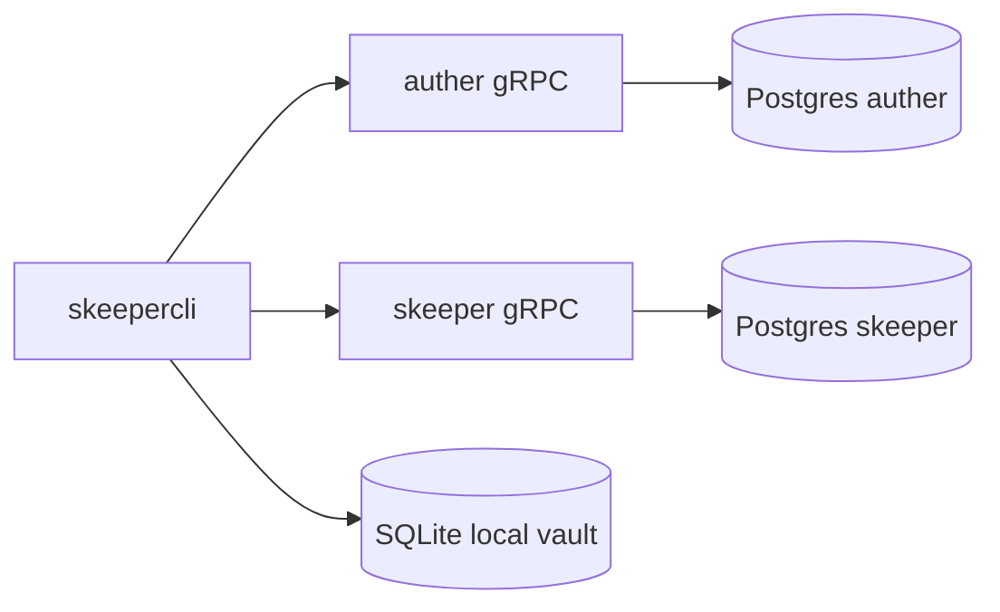

# Skeeper — project specification

This document describes **Skeeper** in the form expected by a typical **client–server password manager** coursework specification: goals, architecture, security, data model, synchronization, and interfaces. It reflects the **current codebase** unless a section explicitly notes a **future / proto-only** idea.

---

## 1. Purpose

Skeeper lets a user:

- **Register** and **log in** to a remote account (email + account password).
- Maintain a **personal vault** of secrets **encrypted on the client** with a **vault master password** (distinct from the account password).
- **Store**, **read**, **update**, and **soft-delete** several kinds of entries locally and **synchronize** ciphertext with a server so other devices can converge.

The server stores **opaque blobs** and metadata required for sync; it does **not** need the vault master password to operate.

---

## 2. System architecture

The system splits into **three programs**:

| Component | Responsibility |
|-----------|----------------|
| **skeepercli** (`cmd/client`) | Interactive CLI; local SQLite vault; encrypt/decrypt; talks to both gRPC services. |
| **auther** (`cmd/auther`) | User accounts; password hashing; JWT **access** and **refresh** tokens. |
| **skeeper** (`cmd/skeeper`) | Authenticated vault API: **Sync** of encrypted entries; **Get/PutVaultCrypto** for KDF salt and master-key verifier. |

Communication is **gRPC** over TCP. TLS can be enabled via configuration (`grpc_tls` on the client; corresponding server TLS settings).

---

## 3. Authentication (Auther)

- **CreateUser** — register with email and account password.
- **Login** — returns access and refresh tokens and user id.
- **ExchangeToken** — refresh rotation / new access token.

The CLI persists session tokens locally and sends the **access token** to **skeeper** (and auther where needed). Vault crypto and entry sync require a **valid JWT** on the vault service.

---

## 4. Vault cryptography (client)

All **payload** and **metadata** encryption happens in the CLI.

### 4.1 Master key

- A random **KDF salt** (per user vault) is stored server-side (`VaultCrypto` in protobuf) and replicated locally.
- The user’s **vault master password** and salt feed **Argon2id** (`argon2.IDKey` with parameters defined in `internal/client/pkg/crypto`) to derive a **32-byte master key**.
- A **verifier** is **SHA-256(master key)**. It is stored on the server (and locally) so the client can check the master password **without** storing the master key or sending the master password over the network.

### 4.2 Per-entry encryption

For each vault entry:

1. A random **data encryption key (DEK)** is generated.
2. **Payload** (type-specific bytes) and **metadata** (JSON, e.g. name, notes, tags, file name for `FILE`) are encrypted with **AES-GCM** under the DEK.
3. The DEK is encrypted with **AES-GCM** under the **master key** and stored as `encrypted_dek`.

The server only sees **ciphertext** fields plus non-secret sync fields (`uuid`, `type`, `version`, `is_deleted`, timestamps).

### 4.3 What never goes on the wire

- Vault **master password**
- Derived **master key**
- **DEK** or **plaintext** payload/metadata

The account password is used only with **auther** for login/register, not for vault blob encryption.

---

## 5. Entry model

### 5.1 Identity and types

- Each entry has a **UUID** generated on the client (time-ordered UUID v7 in the current implementation), supporting offline creation before sync.
- **Type** is a string discriminator. Supported types in the CLI models:

| Type constant | Meaning |
|---------------|---------|
| `PASSWORD` | Login/password-style secret (payload is raw password bytes). |
| `TEXT` | Free-form text. |
| `FILE` | Arbitrary file bytes in payload; original filename held in encrypted metadata. |
| `CARD` | Card fields JSON (`holder`, `number`, `expiry`, `cvc`) in payload. |

### 5.2 Metadata

Metadata is structured (`EntryMetadata` in the use case layer): name, notes, optional extra tags, and for files a sanitized **original filename**. It is serialized to JSON, then encrypted with the same DEK as the payload.

### 5.3 Versioning and deletion

- **`version`** — monotonic **int64** incremented on every logical change (including ciphertext rotation on update, metadata-only updates where implemented, and soft delete). Used for **last-write-wins** style sync on the server.
- **`is_deleted`** — **soft delete**; tombstones sync so other clients can remove the entry.

---

## 6. Local storage (CLI)

The CLI keeps a **SQLite** database under the configured **data directory** (`data_dir` in `config/client.yaml`). It holds:

- Encrypted entries and sync-related fields
- Session tokens
- Local copy of vault KDF salt / verifier

Operations such as **add**, **update**, **delete**, **get**, and **list** work against this store; **sync** exchanges deltas with **skeeper**.

---

## 7. Synchronization (Skeeper)

### 7.1 RPCs

Defined in `api/skeeper.proto`:

- **`Sync`** — client sends local updates; server returns remote updates since the client’s cursor. Response can include **applied update UUIDs** so the client knows which local writes were accepted.
- **`GetVaultCrypto` / `PutVaultCrypto`** — read or publish KDF salt and master verifier for the authenticated user.

### 7.2 Conflict handling

The server stores **one row per entry UUID** per user. Updates apply when the client’s **`version`** is newer than the stored version (exact rules live in `internal/skeeper/usecase`). Stale client writes are not applied; the client learns via **`applied_update_uuids`** and/or subsequent pulls.

**File entries** follow the same model: there is **no merge** of binary content—only a **full ciphertext replace** with a higher **version**.

### 7.3 Large files

Protobuf defines **streaming file upload/download** RPCs, but they are **commented out** in the service definition; the current design stores file **payload inside the encrypted `Entry`**, subject to client **`max_file_bytes`** (configurable).

---

## 8. CLI command surface (summary)

Typical flows:

- **Auth:** `register`, `login`, `logout`
- **Create:** `add password`, `add text`, `add file`, `add card`
- **Read:** `list`, `get <uuid>`
- **Update:** `update password|text|card|file <uuid>` (prompts for fields and master password)
- **Delete:** `delete <uuid>` (soft delete; sync to propagate)
- **Sync:** `sync`

Client settings are merged in Viper (defaults, `SKEEPERCLI_*` env, optional YAML). The only CLI flag is `--config` (path to YAML), also overridable with `SKEEPERCLI_CONFIG`; see `internal/client/pkg/config/config.go` and `internal/client/delivery/cli/app.go`. Wiring: `cmd/client/setup.go`.

---

## 9. API contracts

- **`api/auther.proto`** — `Auther` service: user lifecycle and tokens.
- **`api/skeeper.proto`** — `Skeeper` service: `Sync`, `GetVaultCrypto`, `PutVaultCrypto`.

Go code is generated into the `api` package (`make proto`).

---

## 10. Development

| Command | Description |
|---------|-------------|
| `make build` | Build all three binaries into `bin/`. |
| `make test` | Run tests. |
| `make lint` | Run golangci-lint. |
| `make proto` | Regenerate protobuf / gRPC stubs. |
| `make check` | Imports + lint + test. |

---

## 12. Glossary

| Term | Meaning |
|------|---------|
| **DEK** | Data encryption key; per entry; wrapped by master key. |
| **Master key** | Key derived from vault master password + salt; never stored in plaintext. |
| **Verifier** | SHA-256(master key); proves correct master password without storing the key. |
| **Soft delete** | Entry marked deleted, version bumped, still syncable as a tombstone. |
